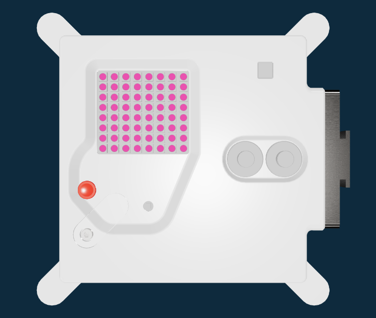

## Colour the LEDs

Experiment with colour values to see what they look like.

Computers use three numbers to describe a colour.

The numbers are between 0 and 255, for the amount of red (R), green (G), and blue (B).

```
hot_pink = (248, 24, 148)
```

In the code on the right, the colour (`c`) is set to black `(0, 0, 0)`.

Change the values of `c` and run the code to see what different colours you can make.

```python filename="main.py" line_numbers="true" line_number_start="13" line_highlights="14"
# Add colour variables and image
c = (248, 24, 148)
```

> [!TIP]
>
> You can use an [RGB colour picker](https://share.google/WkKa3VbOYnhYYkC9h) to find `RGB` values.

> [!DEBUG]
>
> Check that you have commas (`,`) between the numbers you have chosen.

## Now run your code

Run your code and check that the whole screen changes colour.


