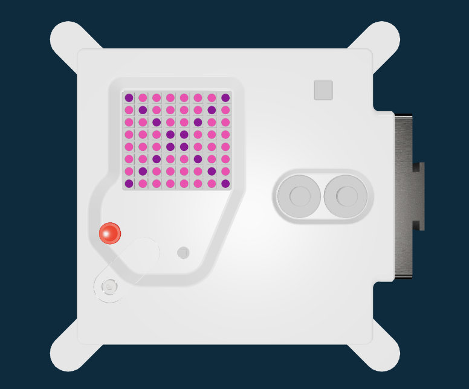

<h2 class="c-project-heading--task">Colour different LEDs</h2>

--- task ---

You can change the colours of specific LEDs

--- /task ---

<h2 class="c-project-heading--explainer">LEDs as a list</h2>

Individual LEDs are shown in the list called `image`.

This is an 8 x 8 grid of letters. Each letter colours a pixel on the Astro Pi.

At the moment, every LED is coloured with the `c` colour you chose.

--- task ---

Create a new colour, and change some of the LEDs to use that colour.

--- /task ---

--- code ---
---
language: python
filename: main.py
line_numbers: true
line_number_start: 13
line_highlights: 15, 18-25
---
# Add colour variables and image
c = (248, 24, 148)
d = (128, 0, 128)

image = [
    d, c, c, c, c, c, c, d,
    c, d, c, c, c, c, d, c,
    c, c, d, c, c, d, c, c,
    c, c, c, d, d, c, c, c,
    c, c, c, d, d, c, c, c,
    c, c, d, c, c, d, c, c,
    c, d, c, c, c, c, d, c,
    d, c, c, c, c, c, c, d
    ]

--- /code ---

--- task ---

Run your code.

--- /task ---

### Debugging

Have you added a second colour? In the example `d = (128, 0, 128)`.

