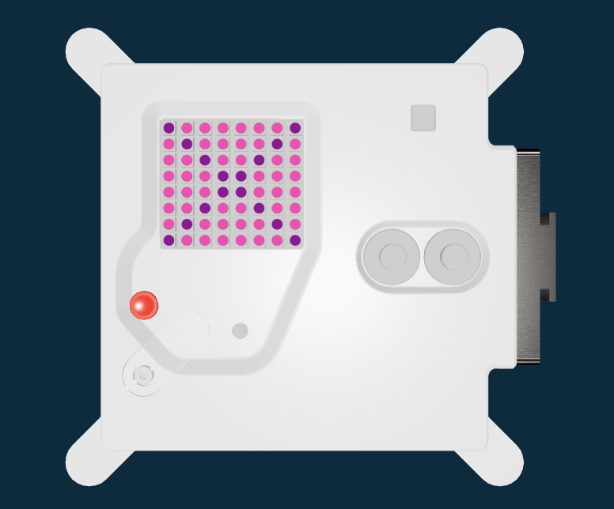

## Colour different LEDs

You can change the colours of specific LEDs.

Individual LEDs are shown in the list called `image`.

This is an 8 x 8 grid of letters. Each letter colours a pixel on the Astro Pi's screen.

At the moment, every LED is coloured with the `c` colour you chose.

Create a new colour and change some of the LEDs to use that colour.

```python filename="main.py" line_numbers="true" line_number_start="13" line_highlights="15,18-25"
# Add colour variables and image
c = (248, 24, 148)
d = (128, 0, 128)

image = [
    d, c, c, c, c, c, c, d,
    c, d, c, c, c, c, d, c,
    c, c, d, c, c, d, c, c,
    c, c, c, d, d, c, c, c,
    c, c, c, d, d, c, c, c,
    c, c, d, c, c, d, c, c,
    c, d, c, c, c, c, d, c,
    d, c, c, c, c, c, c, d
    ]

```

> [!DEBUG]
>
> Have you added a second colour? In the example `d = (128, 0, 128)`.

## Now run your code

Run your code and check that you see a purple cross on the pink background.


