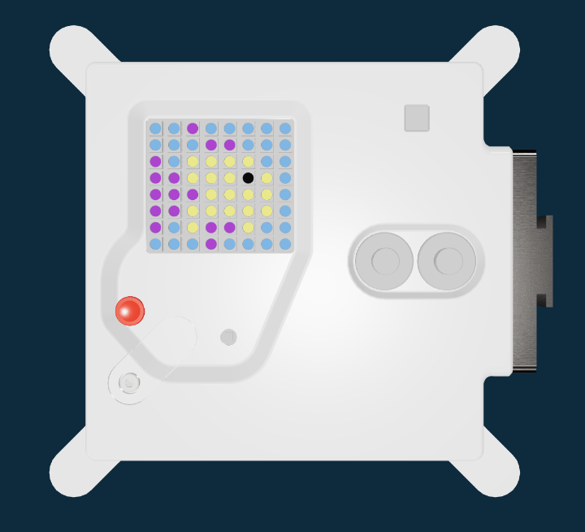

<h2 class="c-project-heading--task">Draw a picture</h2>
--- task ---
Edit your `image` to create your own picture
--- /task ---

By adding more colours, and changing the `image` list, you can create your very own picture on the LED matrix.

The following is an example of a fish

--- task ---

Replace the code below, to use your own colours and create your own image.

--- /task ---

--- code ---
---
language: python
filename: main.py
line_numbers: true
line_number_start: 13
line_highlights: 14-17, 20-27
---
# Add colour variables and image
z = (153, 50, 204) # Tail and fins
q = (255, 255, 0) # Body
d = (51, 153, 255) # Water
c = (0, 0, 0) # Eye

image = [
    d, d, z, d, d, d, d, d,
    d, d, d, z, z, d, d, d,
    z, d, q, q, q, q, d, d,
    z, z, q, q, q, c, q, d,
    z, z, z, q, q, q, q, d,
    z, z, q, q, q, q, q, d,
    z, d, q, z, z, q, d, d,
    d, d, d, z, d, d, d, d,
    ]
--- /code ---

--- task ---

Run your code.

--- /task ---

### Tip

It might help to design your picture on some squared paper.

Or you can use an app like [this one](https://www.piskelapp.com/kids/)

### Debugging

Make sure that every letter used in your image has an RGB value set.

Check that you have 8 columns and 8 rows of colours in your image, and that there are commas at the end of each row.

