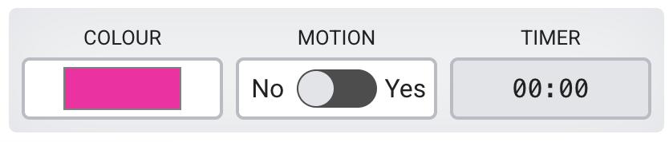
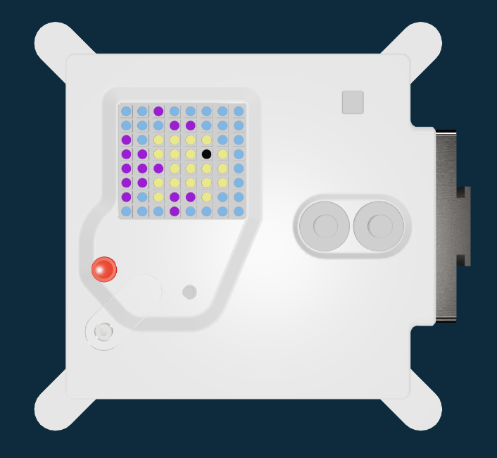

<h2 class="c-project-heading--task">Sense a colour</h2>
--- task ---
The Astro Pi has a colour sensor, to detect colours
--- /task ---

<h2 class="c-project-heading--explainer">Use the colour sensor to change your image</h2>

Choose a new letter to store what the colour sensor on the Astro Pi is "seeing".

Add this colour into your picture somewhere.

It could be:
- The eye colour of a face
- The background colour
- The colour of a flower's petals
- Whatever you like

--- code ---
---
language: python
filename: main.py
line_numbers: true
line_number_start: 13
line_highlights: 19-20
---
# Add colour variables and image
z = (153, 50, 204) # Tail and fins
q = (255, 255, 0) # Body
d = (51, 153, 255) # Water
c = (0, 0, 0) # Eye

rgb = sense.color # get the colour from the sensor
z = (rgb.red, rgb.green, rgb.blue) # colour the fish's tail and fins

image = [
    d, d, z, d, d, d, d, d,
    d, d, d, z, z, d, d, d,
    z, d, q, q, q, q, d, d,
    z, z, q, q, q, c, q, d,
    z, z, z, q, q, q, q, d,
    z, z, q, q, q, q, q, d,
    z, d, q, z, z, q, d, d,
    d, d, d, z, d, d, d, d,
    ]
--- /code ---

Before you click **Run**, change the colour on the colour sensor.

